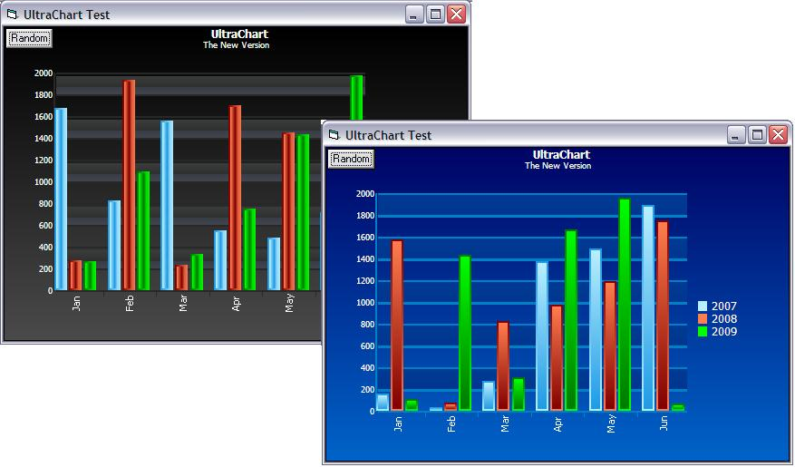

## UltraChart

### Description

UPDATE 2009/12/13

----

Clear method bug fixed,

----

UltraChart, the next generation of WINNER Animated Chart (as i promise before),

There are lots of improvements:

Multi Series added, Full OwnerDraw , Animation On/Off, Print, Save, Now using Tooltip to show data informations rather than label, Customize text rotation and ...

Animated Chart is the first PSC Animation Chart, now all Bar Charts grow simoltaneously,

Hope you like this, please vote and let me know your idea about UltraChart,
 
### More Info
 

             |
---                |---
**Submitted On**   |2009-12-13 14:52:04
**By**             |[Hamed Oveisi](https://github.com/Planet-Source-Code/PSCIndex/blob/master/ByAuthor/hamed-oveisi.md)
**Level**          |Intermediate
**User Rating**    |5.0 (110 globes from 22 users)
**Compatibility**  |VB 6\.0
**Category**       |[Custom Controls/ Forms/  Menus](https://github.com/Planet-Source-Code/PSCIndex/blob/master/ByCategory/custom-controls-forms-menus__1-4.md)
**World**          |[Visual Basic](https://github.com/Planet-Source-Code/PSCIndex/blob/master/ByWorld/visual-basic.md)
**Archive File**   |[UltraChart21702012132009\.zip](https://github.com/Planet-Source-Code/hamed-oveisi-ultrachart__1-72707/archive/master.zip)

